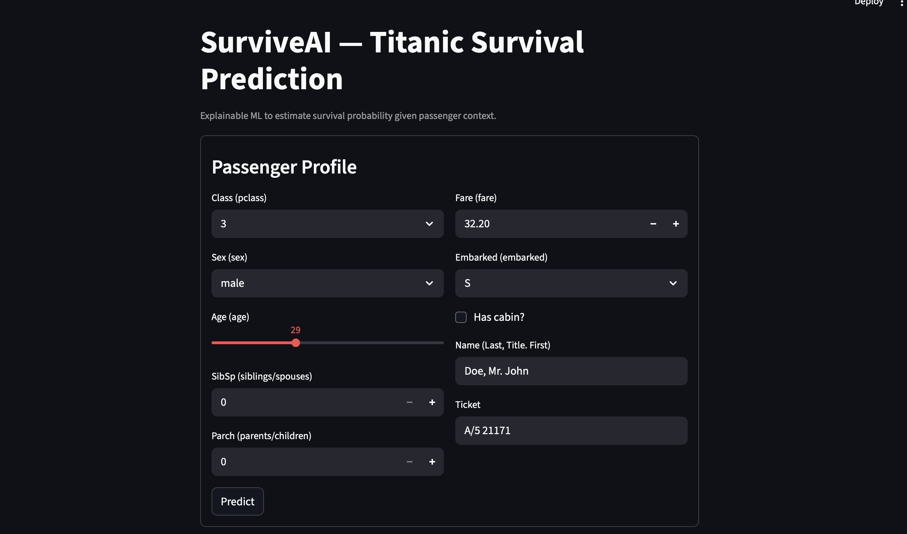
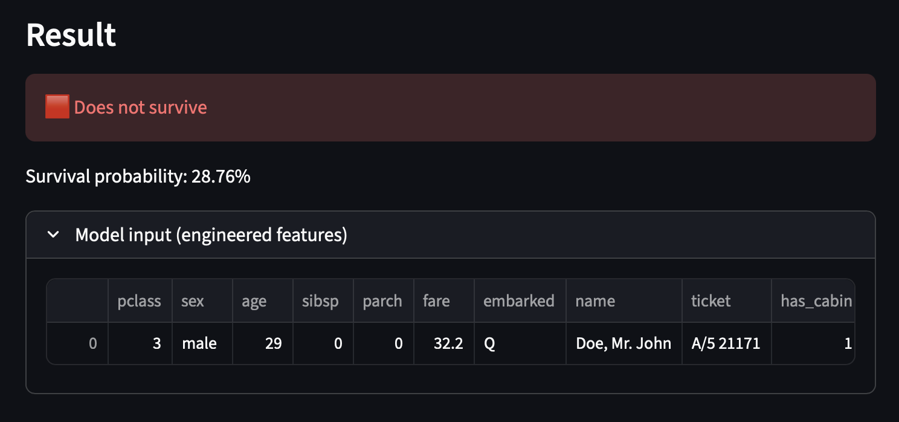

# 🤖 SurviveAI — Full End-to-End Explainable Machine Learning System

> End-to-End Machine Learning Project | EDA • Modeling • Deployment • Interpretability


> 🧠 **Role:** Data Scientist / Machine Learning Engineer  
> 🎯 **Focus:** End-to-End ML Systems • Feature Engineering • Model Interpretability • Deployment


<p align="center">
  
</p>

> **“Data science is not about fitting models — it’s about building intelligent systems that inspire trust and deliver measurable impact.”**

---

## 🧭 Overview  

This project implements a **production-ready Machine Learning system**, from **Exploratory Data Analysis (EDA)** to **deployment of an interactive prediction app** built with Streamlit.

The goal is to predict the probability of human survival in a contextual dataset while demonstrating solid principles of **data engineering, model reproducibility, and user-facing delivery**.

> 🎯 Designed as a professional portfolio project for **Data Scientist / ML Engineer** positions — combining **analytical depth**, **clean engineering**, and **communication clarity**.

**Quick links:**  
[📓 EDA Notebook](Notebook/EDA_SurviveAI.ipynb) • [📓 Modeling Notebook](Notebook/ML_Modeling_SurviveAI.ipynb) • [🧠 Trained Model](models/surviveai_model.joblib) • [💻 App (`app.py`)](app.py)

---

## ⚙️ Tech Stack  

| Layer | Technology | Purpose |
|-------|-------------|----------|
| **Data & EDA** | `pandas`, `numpy`, `matplotlib`, `seaborn` | Cleaning, imputation, and feature discovery. |
| **Modeling** | `scikit-learn`, `Pipeline`, `ColumnTransformer` | Reproducible ML pipeline with preprocessing integration. |
| **Deployment** | `Streamlit`, `joblib` | Interactive web app and model serialization. |
| **Environment** | `Python 3.10+`, `Git`, `Jupyter`, `VSCode` | Reproducible workflow and version control. |

---

## 🧩 Project Structure  

```
SurviveAI-Explainable-ML-System/
│
├── Data/
│ ├── gender_submission.csv
│ ├── test.csv
│ ├── train.csv
│ └── train_clean.csv
│
├── exports/
│ ├── EDA_SurviveAI.html
│ └── ML_Modeling_SurviveAI.html
│
├── images/
│ ├── surviveIA.png
│ ├── streamlit_form.png
│ ├── streamlit_result_ksurvive.png
│ ├── streamlit_result_nsurvive.png
│ └── streamlit_result_ysurvive.png
│
├── models/
│ └── surviveai_model.joblib
│
├── Notebook/
│ ├── EDA_SurviveAI.ipynb
│ └── ML_Modeling_SurviveAI.ipynb
│
├── app.py
├── README.md
└── requirements.txt
```

---

## 🔍 Exploratory Data Analysis (EDA)

### 🎯 Goals
- Detect patterns, correlations, and missing values.  
- Create meaningful social and contextual features.  
- Evaluate distributions, biases, and relationships between key variables.

### 🧹 Steps Performed
- Data cleaning and normalization.  
- `Age` imputation via contextual median (`pclass × sex`).  
- Feature creation:
  - `family_size = sibsp + parch + 1`
  - `is_alone = (family_size == 1)`
  - `fare_per_person = fare / family_size`
  - `has_cabin` → binary flag for cabin availability
  - `title` → extracted from `name` (`Mr`, `Mrs`, `Miss`, `Master`, etc.)
- Encoding categorical variables and scaling numerical ones.  

---

## 🧠 Predictive Modeling  

### ⚗️ Algorithms Evaluated  
- **Logistic Regression** — interpretable and stable baseline.  
- **Random Forest** — non-linear benchmark model.  

### 🧱 Reproducible ML Pipeline  

```python
num_features = ["age", "fare", "family_size", "fare_per_person"]
cat_features = ["sex", "pclass", "embarked", "title", "has_cabin"]

numeric = Pipeline([
    ("imputer", SimpleImputer(strategy="median")),
    ("scaler", StandardScaler())
])

categorical = Pipeline([
    ("imputer", SimpleImputer(strategy="most_frequent")),
    ("encoder", OneHotEncoder(handle_unknown="ignore"))
])

preprocessor = ColumnTransformer([
    ("num", numeric, num_features),
    ("cat", categorical, cat_features)
])

model = Pipeline([
    ("prep", preprocessor),
    ("clf", LogisticRegression(random_state=500))
])
```

### 📈 Results (5-Fold Cross-Validation)

| Model | Accuracy | ROC-AUC |
|:------|:---------:|:-------:|
| **Logistic Regression** | **0.829** | **0.86** |
| Random Forest | 0.817 | 0.84 |

**Hold-out test (20%)**  
- **Accuracy:** 0.849  
- **Precision (Class 1):** 0.81  
- **Recall (Class 1):** 0.80  
- **F1 Score (Class 1):** 0.80  

---

## 💡 Interpretability & Model Insights

From the fitted **logistic regression** (after cleaning & feature engineering), the most influential positive coefficients were:

- `title_Master` — strong positive effect (young male children → “children first” priority).
- `sex_female` — strong positive driver (historical rule: *“women and children first”*).
- `title_Mrs` — positive (adult women).
- `has_cabin` — positive (deck access / proximity to lifeboats).
- `embarked_Q` — mild positive (cohort effect captured by the data).
- `fare` — slight positive contribution.

> These reflect **correlations** learned from historical data — not causation.  
> The pipeline sanitizes identifiers (no raw `name`, `ticket`, `passengerid` leakage) and focuses signal on socially meaningful features like **titles**, **sex**, and **cabin** availability.


---

## 💻 Streamlit Web Application  

**File:** `app.py`
**Description:** Interactive UI for real-time predictions.

### 🧭 User Flow  
1. Input passenger details (`pclass`, `sex`, `age`, `fare`, etc.).  
2. App replicates training-time feature engineering.  
3. Displays class prediction + survival probability.  

📸 **Visuals:**  
  
---

## 📸 App Results — Model Decisions Explained

These visuals show how the deployed Streamlit app interprets passenger profiles to predict **survival class and probability**.  
Under the hood, a **logistic regression** estimates survival log-odds using engineered features (`family_size`, `is_alone`, `fare_per_person`, `title`, `has_cabin`).

Below are three **real** prediction cases that illustrate not only performance but **reasoning** — turning features into explainable outcomes.


### 🔴 Case A — *“Does Not Survive”* (p ≈ **28.76%**)  


**Why the model predicts *No Survival*:**  
- **Sex = male** → strongest negative influence (*“women and children first”*).  
- **Class = 3rd** → lowest evacuation priority and restricted access to lifeboats.  
- **Age = 29** → adult male, not prioritized for rescue.  
- **Has Cabin = 1** → provides a **slight positive effect**, but not enough to offset being a third-class male passenger.  
- **Fare ≈ 32.2** → moderate fare, limited impact in this context.  
- **Embarked = Q** → minor or neutral influence; slightly positive in historical data but insufficient to change the outcome.

📊 **Interpretation:**  
With a **28.76% probability of survival**, the model estimates that this passenger **likely did not survive**.  
Even with a **cabin** and a **neutral embarkation port**, the dominant factors — **male**, **adult**, and **third class** — strongly reduce the overall survival likelihood.

> ⚠️ *This prediction illustrates how social and structural hierarchies in the Titanic dataset heavily influenced survival outcomes, even when individual conditions (like having a cabin) appeared favorable.*

---

### 🟩 Case B — *“Survives”* (p ≈ **97.87%**)  


**Why the model predicts *Survival*:**  
- **Sex = female** → strongest positive influence (*“women and children first”*).  
- **Class = 1st** → highest priority for evacuation and better access to lifeboats.  
- **Age = 37** → adult woman, still within a group prioritized for rescue.  
- **Has Cabin = 1** → strong indicator of wealth and proximity to lifeboats.  
- **Fare ≈ 32.2** → mid-to-high fare, consistent with higher socioeconomic status.  
- **Embarked = Q** → minor factor, but not detrimental; neutral to slightly positive historically.

📊 **Interpretation:**  
With a **97.87% probability of survival**, the model confidently predicts that this passenger **survived**.  
Being a **first-class female passenger with a cabin** overwhelmingly increases the likelihood of rescue, outweighing all other variables.

> ✅ *This case clearly demonstrates the influence of gender and class hierarchy in survival outcomes aboard the Titanic — structural privileges directly translated into life-saving advantages.*

---

### 👦 Case C — “Child Survives” (p ≈ 85.74%)  


**Why the model predicts *Survival*:**  
- **Title = Master** → represents young male children, one of the strongest positive predictors.  
- **Sex = male**, but **age = 6** mitigates the gender effect completely.  
- **Class = 3rd** → low, yet compensated by the *child priority* rule.  
- **Fare ≈ 32** and **Embarked = S** → moderate and neutral influences.  
- **Has Cabin = 0** → not critical when other high-impact factors dominate.

📊 **Interpretation:**  
A **85.74%** survival probability confirms the model’s understanding of the historical principle:  
> “Women and children first.”  
Even with the same ticket conditions as adults, children had a **notably higher survival likelihood**.

> 🧭 These examples transform historical data into human insight — showing how explainable AI can reflect social and ethical structures hidden within real-world datasets.


## Executive Summary

This project demonstrates that survival on the Titanic was not just a matter of chance. By analyzing key features such as gender, class, fare, and embarkation port, we gain a clear picture of how **social structure** and **historical factors** impacted survival odds. For example, **women** and **first-class passengers** had a significantly higher chance of survival. These insights highlight how **societal hierarchies** influenced access to lifeboats and the evacuation process during the disaster.

This analysis is more than just model predictions; it is a **data-driven story** about inequality, survival, and decision-making under extreme conditions. 

---

### 🧠 Key Survival Drivers (from the fitted Logistic Regression)

| Feature          | Impact         | Why it matters (historical context)                  |
|:-----------------|:---------------|:-----------------------------------------------------|
| `title_Master`   | ↑ Strong       | Young male children prioritized during evacuation.   |
| `sex_female`     | ↑ Strong       | “Women and children first” rule in lifeboat access.  |
| `title_Mrs`      | ↑ Moderate     | Adult women benefited from evacuation priority.      |
| `has_cabin`      | ↑ Moderate     | Better deck position & proximity to lifeboats.       |
| `embarked_Q`     | ↑ Mild         | Cohort effect captured in the data.                  |
| `fare`           | ↑ Mild         | Proxy for socioeconomic advantages & access.         |

> ⚠️ **Note:** These are **correlations** observed in the dataset — not causal claims.


> Predictions reflect patterns observed in historical data — they do not imply social or moral causes.

---

### 💡 Takeaway

> 🧭 These examples transform historical data into human insight — showing how explainable AI can reflect social and ethical structures hidden within real-world datasets.


### ⚙️ Run Locally  

```bash
pip install -r requirements.txt
streamlit run app.py

```

---

### 🔁 Reproduce the Model (Training)

```
# 1) Install dependencies
pip install -r requirements.txt

# 2) Open and run the training notebook end-to-end
jupyter notebook Notebook/ML_Modeling_SurviveAI.ipynb

# 3) (Optional) Export trained pipeline to /models
python - << 'PY'
from pathlib import Path
import joblib
# Assuming variable `log_reg` holds the fitted Pipeline inside the notebook
# joblib.dump(log_reg, "models/surviveai_model.joblib")
print("Exported model → models/surviveai_model.joblib")
PY
```

## 🧮 Global Performance Summary  

| Metric | Value |
|:--------|:------:|
| **Accuracy (test)** | 0.849 |
| **ROC-AUC (test)** | 0.86 |
| **Precision (Class 1)** | 0.81 |
| **Recall (Class 1)** | 0.80 |
| **F1-score (Class 1)** | 0.80 |

> Validated via stratified cross-validation — reproducible, no data leakage, fixed random seed.

---

## ✅ Professional Best Practices  

- 🧱 Modular, reproducible pipeline with `ColumnTransformer`.  
- 🔒 Controlled **data leakage** and robust validation.  
- 🧩 Context-aware feature engineering.  
- 📊 Transparent model evaluation (ROC, F1, CV).  
- 💻 Deployed, interactive Streamlit demo.  
- 📦 Version-controlled assets (`joblib`, `requirements.txt`).  

---

### 🚀 Roadmap (v2.0)

**Next upgrades to evolve into a production-grade ML system:**
- 🌐 **REST API** → FastAPI endpoint (`/predict`)
- 🐳 **Docker Deployment** → AWS / Render / Hugging Face Spaces
- 📊 **Monitoring** → Model drift & data quality with Evidently AI
- 🧠 **Explainability** → SHAP / LIME dashboards
- ⚙️ **CI/CD** → Automated GitHub Actions workflows
- 🧪 **Testing** → Pytest, Black, Flake8 for maintainable code


---

## 🧾 Conclusion  

This repository demonstrates a **complete, production-ready ML workflow**, integrating:  

- 🔬 **Analytical rigor:** EDA, feature creation, hypothesis validation.  
- 🧱 **Engineering discipline:** pipelines, serialization, structure.  
- 💻 **Functional product:** Streamlit app for live inference.  
- 🧭 **Reproducibility:** version control, consistent preprocessing.  
- 💡 **Storytelling:** insights that connect data to human behavior.  

> *“Good models predict outcomes. Great systems generate insight, trust, and measurable business value.”*

---

✨ **Author**  
**Joseph Santamaría Castro** 🇨🇷  
🎓 Data Science & Machine Learning | Instituto Tecnológico de Costa Rica (TEC)  
📧 josephsantacastro@gmail.com  
🌐 [LinkedIn](https://www.linkedin.com/in/josephsantacastro/) | 💻 [GitHub](https://github.com/JosephSantamaria)  
📘 *Building intelligent, interpretable systems — where data meets human insight.*

